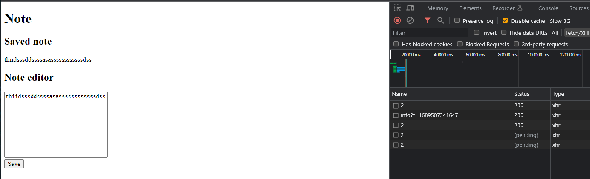
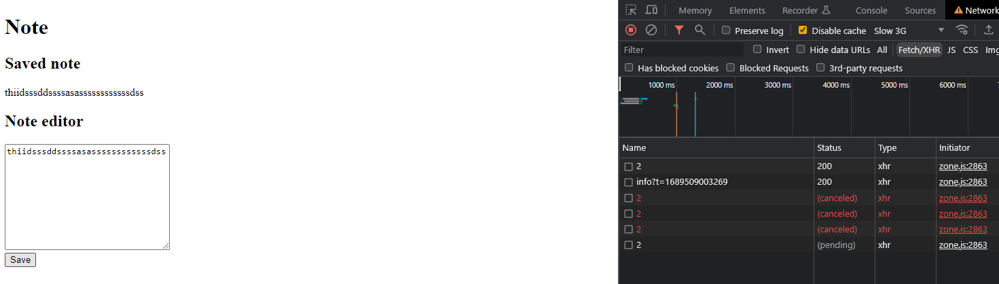

# SwitchMap Vs ConcatMap

Both concatMaps and switchMaps are widely used rxjs operators among the javascript developers. Both of the can be used to map one Observable to another. In Addition it grantees the sequential execution.

## Concat

We will take a sample application that saves the user notes in the database.
Let's say we have a requirement, to save the sate of the note in the database when user clicked the save button. Then after the value saved in the database we need to retrieve the saved value and display it.

We could do this with [concat](https://rxjs.dev/api/index/function/concat).

### NoteComponent class

```typescript
import { concat } from "rxjs";
import { tap } from "rxjs/operators";
import { NoteService } from "src/app/services/note.service";

@Component({
  selector: "app-note",
  templateUrl: "./note.component.html",
  styleUrls: ["./note.component.scss"],
})
export class NoteComponent {
  private static readonly noteId: number = 2;
  note: string = "";
  savedNote: string = "";
  constructor(private noteService: NoteService) {
    this.noteService.getNote(NoteComponent.noteId).pipe(
      tap((n) => {
        this.note = this.savedNote = n.content;
      })
    );
  }

  onSave() {
    concat(
      this.noteService.saveNote(NoteComponent.noteId, this.note),
      this.noteService
        .getNote(NoteComponent.noteId)
        .pipe(tap((n) => (this.savedNote = n.content)))
    ).subscribe();
  }
}
```

### NoteComponent template

```html
<h1>Note</h1>
<div>
  <h2>Saved note</h2>
  <p>{{ savedNote }}</p>
</div>

<div>
  <h2>Note editor</h2>
  <textarea cols="30" rows="10" [(ngModel)]="note"></textarea>
  <div><button (click)="onSave()">Save</button></div>
</div>
```

This works perfectly until user decided to hit save button multiple times. But before that,
We need to change the code to be more reactive.

## Concat and Map

### NoteComponent class

```typescript
import { Component, OnInit } from "@angular/core";
import { Subject, concat } from "rxjs";
import { concatMap, map, startWith, tap } from "rxjs/operators";
import { NoteService } from "src/app/services/note.service";

@Component({
  selector: "app-note",
  templateUrl: "./note.component.html",
  styleUrls: ["./note.component.scss"],
})
export class NoteComponent {
  private static readonly noteId: number = 2;
  note: string = "";
  savedNote: string = "";
  save$ = new Subject<{ id: number; content: string }>();
  constructor(private noteService: NoteService) {
    this.noteService
      .getNote(NoteComponent.noteId)
      .pipe(
        tap((n) => {
          this.note = this.savedNote = n.content;
        })
      )
      .subscribe();

    this.saveAndRefetch$.subscribe();
  }

  saveAndRefetch$ = this.save$.pipe(
    map(({ id, content }) =>
      concat(
        this.noteService.saveNote(id, content),
        this.noteService.getNote(id).pipe(
          tap((n) => {
            this.note = this.savedNote = n.content;
          })
        )
      )
    )
  );

  onSave() {
    this.save$.next({ id: NoteComponent.noteId, content: this.note });
  }
}
```

Here I made the click event to an event stream called save$. Ideally this should work right ?

Unfortunately, It does not. but why?. Let's look at the [map](https://rxjs.dev/api/index/function/map).
operator definition in rxjs docs.

> Applies a given project function to each value emitted by the source Observable, and emits the resulting values as an Observable.

meaning , map operator itself doesn't subscribe to the returned observable. It simply transforms the emitted values. So in the note component, both SAVE and GET note doesn't get subscribed. So what can we do to fix this?.

# Concat and ConcatMap

unlike map, [concatMap](https://rxjs.dev/api/index/function/concatMap) do subscribe to the returned observables. In addition, it waits for previous observable to complete before subscribing to next one. So let's fix it.

### NoteComponent class

```typescript
import { Component, OnInit } from "@angular/core";
import { Subject, concat } from "rxjs";
import { concatMap, map, startWith, tap } from "rxjs/operators";
import { NoteService } from "src/app/services/note.service";

@Component({
  selector: "app-note",
  templateUrl: "./note.component.html",
  styleUrls: ["./note.component.scss"],
})
export class NoteComponent {
  private static readonly noteId: number = 2;
  note: string = "";
  savedNote: string = "";
  save$ = new Subject<{ id: number; content: string }>();
  constructor(private noteService: NoteService) {
    this.noteService
      .getNote(NoteComponent.noteId)
      .pipe(
        tap((n) => {
          this.note = this.savedNote = n.content;
        })
      )
      .subscribe();

    this.saveAndRefetch$.subscribe();
  }

  saveAndRefetch$ = this.save$.pipe(
    concatMap(({ id, content }) =>
      concat(
        this.noteService.saveNote(id, content),
        this.noteService.getNote(id).pipe(
          tap((n) => {
            this.note = this.savedNote = n.content;
          })
        )
      )
    )
  );

  onSave() {
    this.save$.next({ id: NoteComponent.noteId, content: this.note });
  }
}
```

now before handling multiple click scenario let's refactor the code again with concatMap.

### NoteComponent class

```typescript
import { Component, OnInit } from "@angular/core";
import { Subject, concat } from "rxjs";
import {
  concatMap,
  delay,
  map,
  startWith,
  switchMap,
  tap,
} from "rxjs/operators";
import { NoteService } from "src/app/services/note.service";

@Component({
  selector: "app-note",
  templateUrl: "./note.component.html",
  styleUrls: ["./note.component.scss"],
})
export class NoteComponent {
  private static readonly noteId: number = 2;
  note: string = "";

  save$ = new Subject<{ id: number; content: string }>();
  constructor(private noteService: NoteService) {}

  note$ = this.noteService.getNote(NoteComponent.noteId);
  savedNote$ = this.save$.pipe(
    concatMap(({ id, content }) => this.noteService.saveNote(id, content)),
    startWith(this.note$),
    concatMap(() => this.note$),
    map((n) => n.content),
    tap((c) => (this.note = c))
  );

  onSave() {
    this.save$.next({ id: NoteComponent.noteId, content: this.note });
  }
}
```

### NoteComponent template

```html
<h1>Note</h1>
<div>
  <h2>Saved note</h2>
  <p>{{ savedNote$ | async }}</p>
</div>

<div>
  <h2>Note editor</h2>
  <textarea cols="30" rows="10" [(ngModel)]="note"></textarea>
  <div><button id="save-btn" (click)="onSave()">Save</button></div>
</div>
```

here I have removed the concat and break down saving and refetching using concatMap. Also I have removed the subscription in the constructor which fetch the initial note, and replaced with startWith to emit the initial value along the savedNote stream itself.

now, to actually see the effect of multiple clicks, we need to enable the throttling in the browser. I have set the throttling level to [Slow 3G](https://developer.chrome.com/docs/devtools/network/reference/#throttling-profile)

<div>
<figure>
    
    <figcaption align = "center" >multiple clicks with throttling level set to Slow 3G - using concatMap<figcaption>
<figure>
</div>

Here, it seems save requests are not canceled (unsubscribed) when user do multiple clicks. So What can we do to fix this ?

# SwitchMap

switchMap has a special behavior compared to concatMap.

> switchMap Projects each source value to an Observable which is merged in the output Observable, emitting values only from the most recently projected Observable.

As the docs says. switchMap always emit the most recent. That means, when new value emitted, it immediately unsubscribe from previous observables. This is exactly what we need to make this work. Ween need to cancel save request if user hit the save again to make sure we save the most recent change.

### NoteComponent class

```typescript
import { Component, OnInit } from "@angular/core";
import { Subject, concat } from "rxjs";
import {
  concatMap,
  delay,
  map,
  startWith,
  switchMap,
  tap,
} from "rxjs/operators";
import { NoteService } from "src/app/services/note.service";

@Component({
  selector: "app-note",
  templateUrl: "./note.component.html",
  styleUrls: ["./note.component.scss"],
})
export class NoteComponent {
  private static readonly noteId: number = 2;
  note: string = "";

  save$ = new Subject<{ id: number; content: string }>();
  constructor(private noteService: NoteService) {}

  note$ = this.noteService.getNote(NoteComponent.noteId);
  savedNote$ = this.save$.pipe(
    switchMap(({ id, content }) => this.noteService.saveNote(id, content)),
    startWith(this.note$),
    switchMap(() => this.note$),
    map((n) => n.content),
    tap((c) => (this.note = c))
  );

  onSave() {
    this.save$.next({ id: NoteComponent.noteId, content: this.note });
  }
}
```

Here if you want, you can use switchMap to only save and keep using concatMap for fetch. But then the fetch request want cancel out.

<div>
<figure>
    
    <figcaption align = "center" >multiple clicks with throttling level set to Slow 3G - using switchMap<figcaption>
<figure>

</div>

## Common Misconception

A common misconception we see on most places is expecting this type of code to have the cancellation behavior.

### NoteComponent class

```typescript
import { Component } from "@angular/core";
import { switchMap, tap } from "rxjs/operators";
import { NoteService } from "src/app/services/note.service";

@Component({
  selector: "app-note",
  templateUrl: "./note.component.html",
  styleUrls: ["./note.component.scss"],
})
export class NoteComponent {
  private static readonly noteId: number = 2;
  note: string = "";
  savedNote: string = "";

  constructor(private noteService: NoteService) {
    this.noteService
      .getNote(NoteComponent.noteId)
      .pipe(tap(({ content }) => (this.note = this.savedNote = content)));
  }

  onSave() {
    this.noteService
      .saveNote(NoteComponent.noteId, this.note)
      .pipe(
        switchMap(() => this.noteService.getNote(NoteComponent.noteId)),
        tap(({ content }) => (this.savedNote = content))
      )

      .subscribe();
  }
}
```

The reason this won't cancel requests even when using switchMap, is because the observable(saveNote), the switchMap applied to will only emit one value. So each time user click save there will be new Observable created. This also means we can use both concatMap and switchMap in this scenario, which guarantees sequential execution and mapping one Observable to another.
